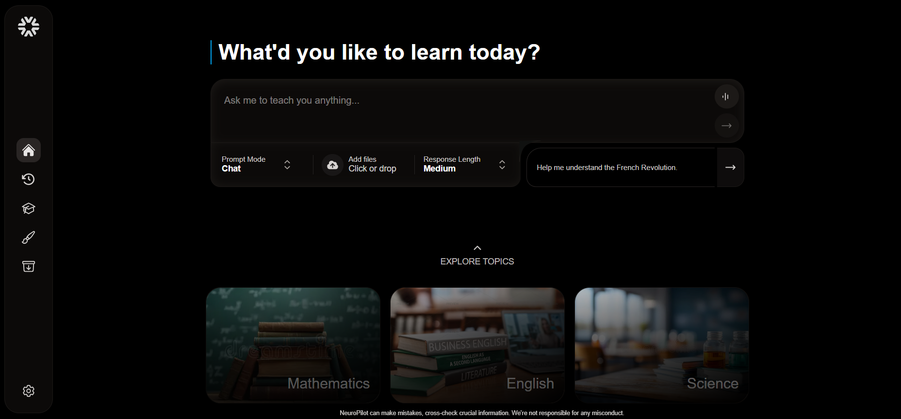

<div align="center">


# DrLeeLM

**An open source AI powered education platform that transforms study materials into interactive learning experiences, slightly inspired by NotebookLM**

[Report Bug](https://github.com/ernestolee/DrLeeLM/issues) • [Request Feature](https://github.com/ernestolee/DrLeeLM/issues)

</div>

<p align="center">
  <a href="LICENSE"></a>
  <a href="https://nodejs.org/"></a>
  <a href="https://reactjs.org/"></a>
  <a href="https://www.typescriptlang.org/"></a>
</p>

---

## Demo



---

## 🚀 Features

DrLeeLM converts study material into **interactive resources** including quizzes, flashcards, structured notes, and podcasts.
The platform provides a modern interface for students, educators, and researchers to **enhance learning efficiency** using state-of-the-art LLMs and TTS systems.

### Learning Tools

- **Contextual Chat** – Ask questions about uploaded documents (PDF, DOCX, Markdown, TXT)
- **SmartNotes** – Generate Cornell-style notes automatically from topics or uploaded content
- **Flashcards** – Extract non-overlapping flashcards for spaced repetition
- **Quizzes** – Create interactive quizzes with hints, explanations, and scoring
- **AI Podcast** – Convert notes and topics into engaging audio content for learning on the go
- **Voice Transcribe** - Convert lecture recordings and voice notes into organized, searchable study materials instantly.
- **Homework Planner** - Plans your Homework Smartly using AI, Assists if your stuck.
- **ExamLab** - Simulate any exam, get feedback, and be prepared for the exam
- **Debate** - Debate with AI to improve your Debate skills.
- **Study Companion** - A personalised AI Companion that assists you.

### Supported AI Models

- Google Gemini • OpenAI GPT • Anthropic Claude • xAI Grok • Ollama (local) • OpenRouter

### Embedding Providers

- OpenAI • Gemini • Ollama

### Technical Highlights

- WebSocket streaming for real-time chat, notes, and podcast generation
- JSON or vector database support for embeddings and retrieval
- File-based persistent storage for generated content
- Markdown-based outputs for structured answers and notes
- Configurable multi-provider setup for LLMs and TTS engines

---

## 🛠️ Technology Stack

| Component      | Technology                               |
| -------------- | ---------------------------------------- |
| **Backend**    | Node.js, TypeScript, LangChain, Langraph |
| **Frontend**   | Vite, React, TailwindCSS                 |
| **Database**   | JSON (default), optional vector DB       |
| **AI/ML**      | Multiple LLM providers, embeddings       |
| **Audio**      | Edge TTS, ElevenLabs, Google TTS         |
| **Deployment** | Docker, Docker Compose                   |
| **Docs**       | pdf-lib, mammoth, pdf-parse              |

---

## ⚡ Getting Started

### Prerequisites

- Node.js v21.18+
- npm or pnpm
- ffmpeg (required for podcast audio)
- Docker (optional)

### Local Development

```bash
# Clone the repository
git clone https://github.com/ernestolee/DrLeeLM.git
cd DrLeeLM

# Install dependencies
cd backend
npm install
cd ../frontend
npm install

# Setup environment
cd ..
npm i -g nodemon
cp .env.example .env
# Make sure to configure API keys and settings in .env

# Run these two commands in separate terminals but inside the project directory.
# Run backend
cd backend
npm run dev

# Run frontend
cd frontend
npm run dev
```

👉 Access at: **http://localhost:5173**

### Docker Deployment

```bash
# Development
docker compose up --build

# Production
docker compose -f docker-compose.yml -f docker-compose.prod.yml up -d --build
```

- Frontend: http://localhost:5173 (dev) / http://localhost:8080 (prod)
- Backend: http://localhost:5000

---

## ⚙️ Configuration

All configuration is handled via environment variables:

- **LLM Provider** – Choose your model backend
- **TTS Engine** – Select speech service for podcasts
- **Database Backend** – JSON or vector DB
- **File Upload Limits** – Customize size/format limits

See `.env.example` for all options.

---

## 🤝 Contributing

We welcome all contributions.

1. Fork the repository
2. Create a feature branch (`git checkout -b feature/new-feature`)
3. Commit changes (`git commit -m "Add feature"`)
4. Push (`git push origin feature/new-feature`)
5. Open a Pull Request

**Guidelines:**

- Follow code style and conventions
- Add tests where needed
- Update docs for new features
- Ensure all tests pass before PR

---

## 💡 Areas to Contribute

- AI model integrations
- Mobile app support
- Performance improvements
- Accessibility features
- Docs & tutorials

---

## 📜 License

Licensed under the **DrLeeLM Community License**.
Free to use, share, and modify for personal and educational purposes.
Commercial use or resale requires prior written permission.

See [LICENSE](LICENSE.md) for full terms.

---

<div align="center">

**Built with ❤️ by Dr. Lee and contributors**

⭐ Star us on [GitHub](https://github.com/ernestolee/DrLeeLM) if this project helps you!

</div>
