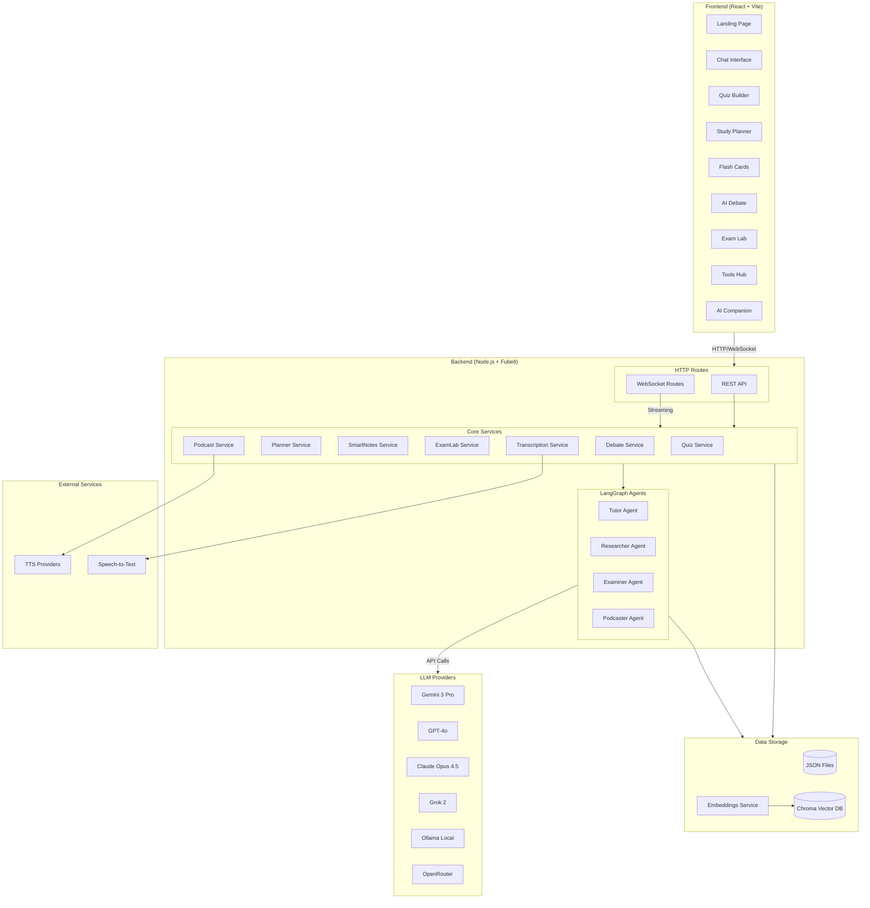
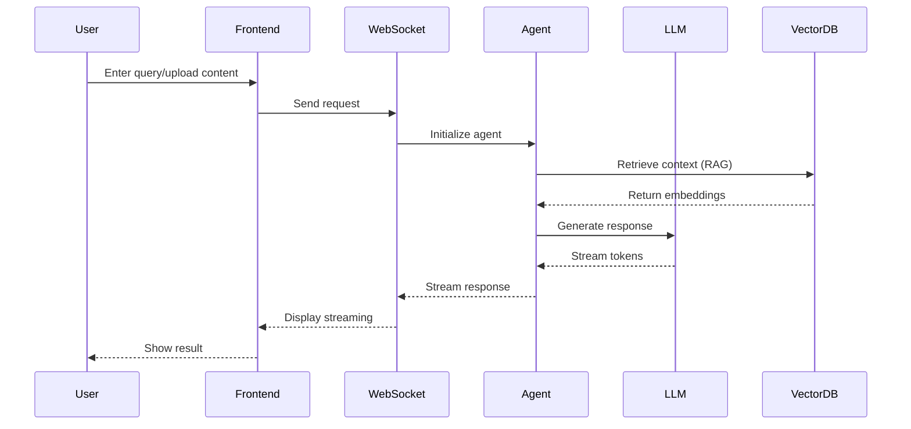
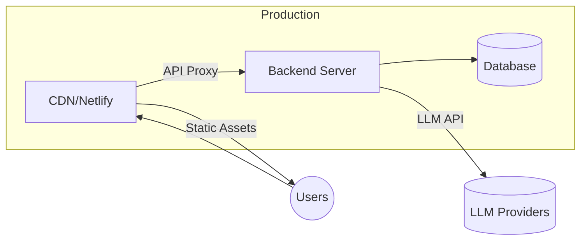
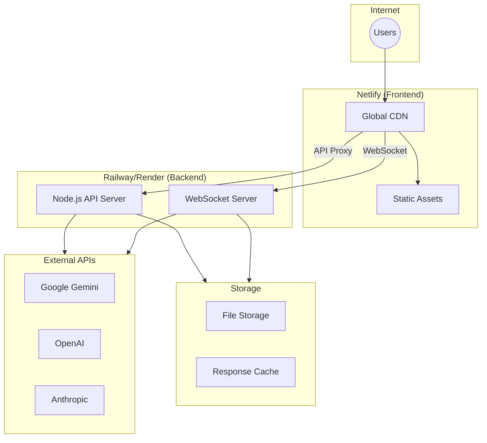

# DrLeeLM Architecture

## High-Level System Architecture



## Data Flow Architecture



## Component Details

### Frontend Pages
| Page | Route | Description |
|------|-------|-------------|
| Landing | `/` | Welcome page with feature overview |
| Chat | `/chat` | Main AI tutor chat interface |
| Quiz | `/quiz` | AI-generated quiz builder |
| Planner | `/planner` | Study schedule generator |
| Flash Cards | `/flashcards` | Spaced repetition cards |
| Debate | `/debate` | AI debate simulator |
| Exam Lab | `/examlab` | Practice exam generator |
| Tools | `/tools` | Utility tools hub |
| Companion | `/companion` | AI study companion |

### Backend Services
| Service | Purpose |
|---------|---------|
| Quiz Service | Generate and grade quizzes |
| Planner Service | Create study schedules |
| SmartNotes Service | Summarize and organize notes |
| ExamLab Service | Generate practice exams |
| Podcast Service | Convert content to audio |
| Debate Service | Facilitate AI debates |
| Transcription Service | Speech-to-text processing |

### LLM Configuration
| Provider | Model | Use Case |
|----------|-------|----------|
| Gemini | gemini-3-pro-preview | Primary LLM |
| OpenAI | gpt-4o-mini | Fallback/Embeddings |
| Claude | claude-opus-4-5-20251101 | Advanced reasoning |
| Grok | grok-2-latest | Alternative |
| Ollama | llama4 | Local/offline |
| OpenRouter | Various | Routing |

### Storage Options
- **JSON Mode**: Simple file-based storage for development
- **Chroma DB**: Vector database for RAG operations
- **Embeddings**: OpenAI text-embedding-3-large or Gemini text-embedding-004

## Deployment Architecture



## Technology Stack

### Frontend
- React 18 + TypeScript
- Vite (build tool)
- TailwindCSS (styling)
- React Router (navigation)
- Socket.io Client (real-time)

### Backend
- Node.js + TypeScript
- Fubelt (HTTP framework)
- Socket.io (WebSocket)
- LangChain + LangGraph (AI)
- Zod (validation)

### Infrastructure
- Netlify (frontend hosting)
- Railway/Render/Fly.io (backend)
- Environment-based configuration

---

## Deployment Guide

### Frontend Deployment (Netlify)

**Recommended**: Netlify for frontend hosting

1. **Build Settings**:
   - Build command: `cd frontend && npm run build`
   - Publish directory: `frontend/dist`
   - Node version: 20+

2. **Environment Variables**:
   ```
   VITE_BACKEND_URL=https://your-backend-url.com
   ```

3. **Redirects** (create `frontend/public/_redirects`):
   ```
   /*    /index.html   200
   ```

### Backend Deployment Options

| Platform | Pros | Cons | Cost |
|----------|------|------|------|
| **Railway** | Easy deploy, auto-scaling, WebSocket support | Limited free tier | ~$5-20/mo |
| **Render** | Free tier, WebSocket support, easy setup | Cold starts on free tier | Free-$25/mo |
| **Fly.io** | Global edge, WebSocket support, Docker | More complex setup | ~$5-15/mo |
| **DigitalOcean App Platform** | Reliable, simple, WebSocket support | No free tier | ~$5-12/mo |
| **AWS Lambda + API Gateway** | Scalable, pay-per-use | Complex for WebSockets | Variable |
| **Vercel** | Great DX, serverless | WebSocket limitations | Free-$20/mo |
| **Self-hosted VPS** | Full control, cheapest long-term | Maintenance required | ~$5-10/mo |

### Recommended: Railway or Render

#### Railway Deployment
```bash
# Install Railway CLI
npm i -g @railway/cli

# Login and deploy
railway login
railway init
railway up
```

Environment variables to set in Railway:
```
HOST=0.0.0.0
PORT=5001
LLM_PROVIDER=gemini
EMB_PROVIDER=openai
OPENAI_API_KEY=sk-...
gemini=AIza...
# Add all other .env variables
```

#### Render Deployment
1. Connect your GitHub repo
2. Create a new Web Service
3. Configure:
   - Build command: `cd backend && npm install`
   - Start command: `cd backend && npm run start`
   - Environment: Node
4. Add environment variables from `.env`

### Architecture for Production



---

## Docker Deployment (Recommended)

The backend can be containerized using Docker for consistent deployments.

### Build and Run Locally
```bash
# Build the image
docker build -t drleelm-backend .

# Run with environment file
docker run -d \
  --name drleelm-backend \
  -p 5001:5001 \
  --env-file .env \
  -v $(pwd)/data:/app/data \
  drleelm-backend

# Or use docker-compose
docker-compose up -d
```

### DigitalOcean Deployment (Docker)

**Option 1: DigitalOcean App Platform (Easiest)**

1. Push your code to GitHub
2. Go to DigitalOcean App Platform → Create App
3. Connect your GitHub repo
4. Configure:
   - Type: Web Service
   - Dockerfile path: `./Dockerfile`
   - HTTP Port: 5001
5. Add environment variables from `.env`
6. Deploy

**Option 2: DigitalOcean Droplet with Docker**

```bash
# 1. Create a Droplet (Ubuntu 22.04, $6/mo minimum)
# 2. SSH into your droplet
ssh root@your-droplet-ip

# 3. Install Docker
curl -fsSL https://get.docker.com -o get-docker.sh
sh get-docker.sh

# 4. Clone your repo
git clone https://github.com/ernestolee/DrLeeLM.git
cd DrLeeLM

# 5. Create .env file
nano .env
# Add all your environment variables

# 6. Build and run
docker build -t drleelm-backend .
docker run -d \
  --name drleelm-backend \
  -p 5001:5001 \
  --env-file .env \
  -v /root/drleelm-data:/app/data \
  --restart unless-stopped \
  drleelm-backend

# 7. Set up Nginx reverse proxy (for SSL)
apt install nginx certbot python3-certbot-nginx -y

# Create nginx config
cat > /etc/nginx/sites-available/drleelm << 'EOF'
server {
    server_name api.yourdomain.com;

    location / {
        proxy_pass http://localhost:5001;
        proxy_http_version 1.1;
        proxy_set_header Upgrade $http_upgrade;
        proxy_set_header Connection "upgrade";
        proxy_set_header Host $host;
        proxy_set_header X-Real-IP $remote_addr;
        proxy_read_timeout 300s;
    }
}
EOF

ln -s /etc/nginx/sites-available/drleelm /etc/nginx/sites-enabled/
nginx -t && systemctl reload nginx

# 8. Get SSL certificate
certbot --nginx -d api.yourdomain.com
```

**Option 3: DigitalOcean Container Registry + Kubernetes**

For production at scale:
```bash
# 1. Create Container Registry in DO dashboard
# 2. Push image
doctl registry login
docker tag drleelm-backend registry.digitalocean.com/your-registry/drleelm-backend
docker push registry.digitalocean.com/your-registry/drleelm-backend

# 3. Deploy to Kubernetes cluster using the image
```

### Environment Variables Template
```env
# Server
HOST=0.0.0.0
PORT=5001
NODE_ENV=production

# LLM Provider (gemini, openai, claude, grok, ollama)
LLM_PROVIDER=gemini

# Embeddings Provider (openai, gemini)
EMB_PROVIDER=openai

# API Keys
gemini=AIza...
OPENAI_API_KEY=sk-...
ANTHROPIC_API_KEY=sk-ant-...
XAI_API_KEY=xai-...

# Optional: CORS (comma-separated frontend URLs)
CORS_ORIGINS=https://yourdomain.com,https://www.yourdomain.com
```

### Deployment Checklist

- [ ] Build Docker image and test locally
- [ ] Push code to GitHub
- [ ] Create DigitalOcean App/Droplet
- [ ] Set all environment variables
- [ ] Configure CORS for your frontend domain
- [ ] Set `VITE_BACKEND_URL` in Netlify (frontend)
- [ ] Set up SSL/HTTPS
- [ ] Test WebSocket connections
- [ ] Configure custom domain (optional)
- [ ] Test all features end-to-end
